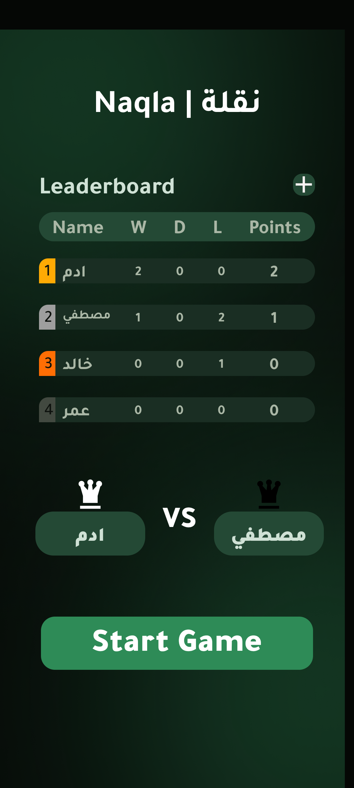
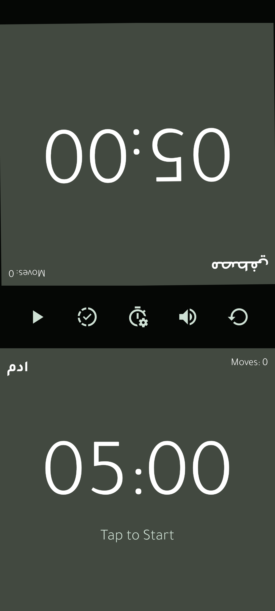

# ♟️ Naqla Chess Clock App

A smart, responsive chess clock app with real-time sounds, player statistics, and a global leaderboard —  
built with **Expo**, **React Native**, and **Redux Toolkit**.

---

## 🧩 Overview

**Naqla Chess Clock** is a modern chess timer app that tracks each player's time during a match,  
records match results, calculates points based on wins and draws, and displays a leaderboard to show player rankings.

It also includes dynamic sound effects that react to gameplay —  
making every move more engaging and intense.

---

## ⚙️ Features

- 🕒 **Smart Chess Clock**  
  Each player has a personal countdown timer that switches turns automatically.

- 🧠 **Automatic Scoring System**  
  - Win → +1 points  
  - Draw → +0.5 point  
  - Loss → 0 points  
  The leaderboard updates automatically after every game.

- 📊 **Player Statistics**  
  The app tracks detailed match stats — total games, wins, draws, and losses.

- 🔊 **Dynamic Sound Effects**  
  - After **30 seconds**, a subtle alert sound plays.  
  - After **50 seconds**, a more urgent sound warns the player.  
  - Random sound effects trigger when turns change to keep the gameplay lively.

- 🏆 **Leaderboard System**  
  Displays all players ranked by their total points and performance.

- 💾 **Persistent Data**  
  All player info and stats are stored locally using AsyncStorage.

---

## 🛠️ Tech Stack

| Category | Tools / Libraries |
|-----------|------------------|
| Framework | [Expo](https://expo.dev/) + React Native |
| State Management | Redux Toolkit + React Redux |
| UI Components | React Native Paper + React Native SVG |
| Performance | @shopify/flash-list |
| Audio | Expo Audio |
| Animations | React Native Reanimated |
| Responsive Layout | react-native-responsive-dimensions / fontsize |
| Utilities | AsyncStorage, Expo Haptics, Expo Blur, Expo Keep Awake |

---

## 📸 Screenshots

### 🏠 Home Screen


### ⏱️ In-Game Clock


> _(You can insert your screenshots here when uploading to GitHub)_

---

## 🚀 How to Run

```bash
# Install dependencies
npm install

# Start the project
npx expo start

# Run on Android
npx expo run:android

# Run on iOS
npx expo run:ios
